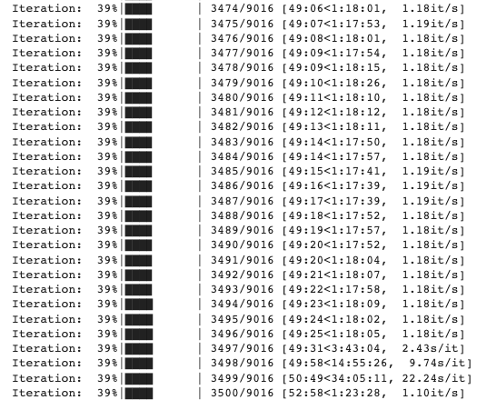
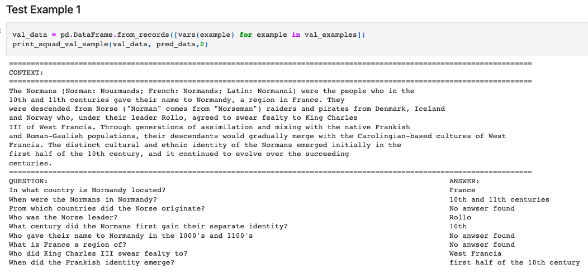
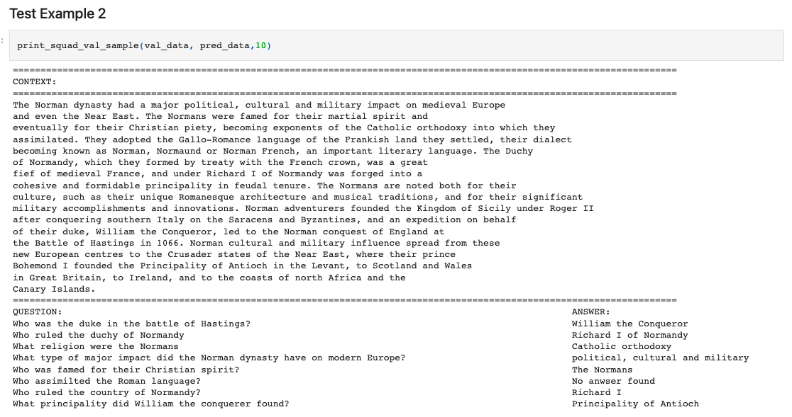
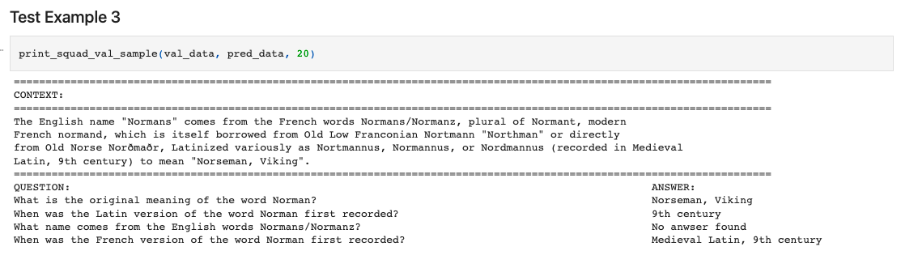
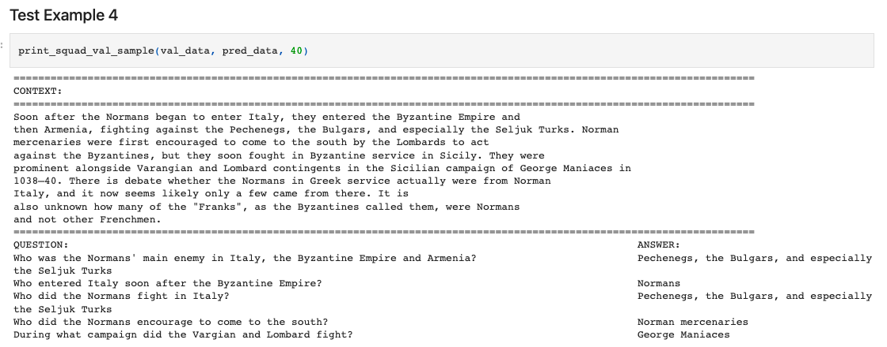
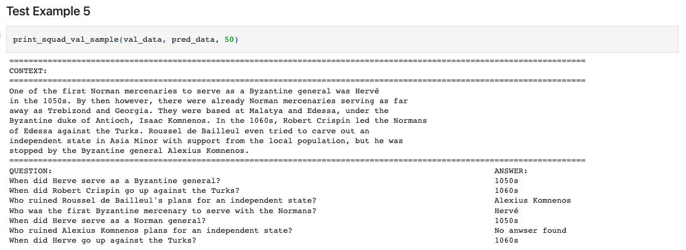

# Session 11 (task1)
The School of AI - END3 Course, Session 11 Assignment Task 1

*Group Members: Dhruba Adhikary, Phani Nandula, Prateek Maheshwari, Sujit Ojha*

# Assignment
These are the assignments that you'd be doing this and next week!

- **TASK 1 (Week 1)**: Train BERT using the code mentioned [here](https://drive.google.com/file/d/1Zp2_Uka8oGDYsSe5ELk-xz6wIX8OIkB7/view?usp=sharing) on the Squad Dataset for 20% overall samples (1/5 Epochs). Show results on 5 samples.     
- **Proceed to Session 11** - Assignment Solutions page and:
    - Submit README link for Task 1 (training log snippets and 5 sample results along with BERT description must be available)

# Notebook
- [Link](BERT_Tutorial_How_To_Build_a_Question_Answering_Bot.ipynb) 

# Training Logs

# Sample Results

