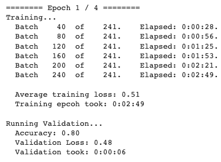
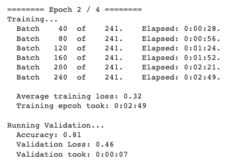
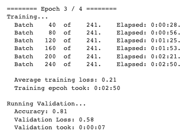
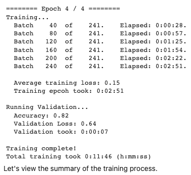
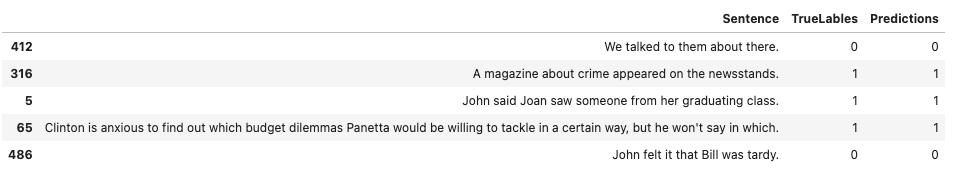

# Session 11
The School of AI - END3 Course, Session 11 Assignment

*Group Members: Dhruba Adhikary, Phani Nandula, Prateek Maheshwari, Sujit Ojha*

# Assignment
These are the assignments that you'd be doing this and next week!

- **TASK 2 (Week 1)**: Reproductive [these](https://mccormickml.com/2019/07/22/BERT-fine-tuning/) results, and show output on 5 samples.  
 
- **Proceed to Session 11** - Assignment Solutions page and:
    - Submit README link for Task 2 (training log snippets and 5 sample results)

# Notebook
- [Link](BERT_Fine_Tuning_Sentence_Classification_v4.ipynb) 

# Training Logs

# Sample Results

